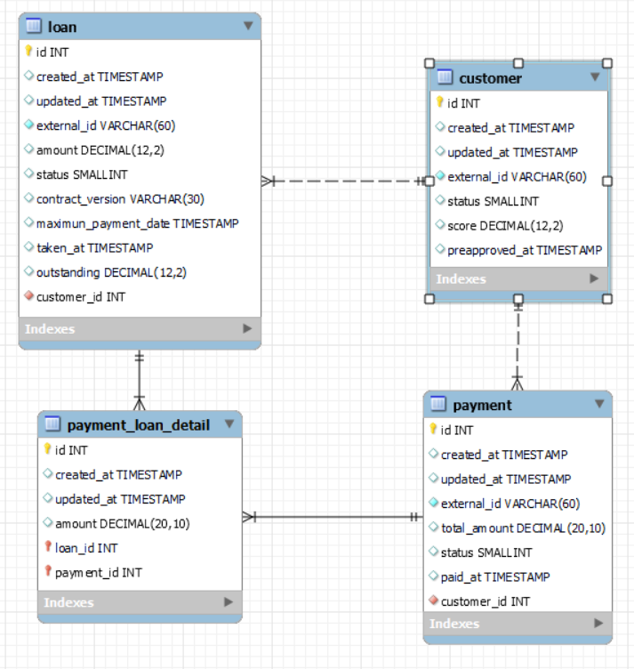

# Loans API Documentation

## Overview

This documentation outlines how to set up and use the Loans API, a Django backend designed for secure and efficient management of customer and loan data.

## API Endpoints

The API is structured around the following endpoints:

### Authentication

- **Obtain Token Pair**: `POST /api/token-auth/` - Obtain an access token pair.

## Getting Started

### Prerequisites

- Python 3.10.0 or higher
- Django 5.0.6 or higher
- Django REST framework 3.15.1 or higher

### Installation

1. Clone the repository:
    ```
    git clone https://github.com/Sergioarg/loans_api.git
    ```
2. Navigate to the project directory:
   ```
   cd users_api/
   ```
3. Create a virtual environment (optional but recommended):
   ```
   python3 -m venv venv
   ```
4. Activate the virtual environment:
   - On Windows:
      ```
      .\venv\Scripts\activate
      ```
   - On Unix or MacOS:
     ```
     source venv/bin/activate
     ```
5. Install the required packages:
   ```
   pip3 install -r requirements.txt
   ```
6. Apply migrations to set up the database:
   ```
   python3 manage.py migrate
   ```
7. Create an admin user:
   ```
    python3 manage.py createsuperuser --username admin --email admin@example.com
   ```

## Running the Server

To start the server, run:
```
python manage.py runserver
```
The server will start at `http://localhost:8000`.

## API Endpoints

### Usage

To interact with the API, you can use tools like `curl`, Postman, or any HTTP client library in your preferred programming language.

Endpoint: `http://127.0.0.1:8000/api/token-auth/`

- **Obtain API Token**
  - **Endpoint**: `/api/token-auth/`
  - **Method**: `POST`
  - **Body**:
    ```json
    {
      "username": "exampleuser",
      "password": "examplepassword"
    }
    ```
  - **Response**:
    ```json
    {
      "token": "API-TOKEN"
    }
    ```

- Curl Example:
```bash
  curl --location --request GET 'http://127.0.0.1:8000/api/customers/' \
  --header 'Content-Type: application/json' \
  --header 'Authorization: Token <YOUR_TOKEN>'
```


### Customers Management

<details>
  <summary>Table of methods</summary>
  <table>
  <thead>
    <tr>
      <th>Endpoint</th>
      <th>Method</th>
      <th>Description</th>
      <th>Response</th>
      <th>Request Body</th>
      <th>Parameters</th>
    </tr>
  </thead>
  <tbody>
    <tr>
      <td>/api/customers/</td>
      <td>GET</td>
      <td>Retrieves a list of all customers.</td>
      <td>An array of <code>Customer</code> objects.</td>
      <td>N/A</td>
      <td>N/A</td>
    </tr>
    <tr>
      <td>/api/customers/{id}/</td>
      <td>GET</td>
      <td>Retrieves a specific customer by their ID.</td>
      <td>A <code>Customer</code> object or <code>404 Not Found</code> if the customer does not exist.</td>
      <td>N/A</td>
      <td><code>id</code>: The ID of the customer.</td>
    </tr>
    <tr>
      <td>/api/customers/{id}/balance</td>
      <td>GET</td>
      <td>Retrieves the balance of the customer by their ID.</td>
      <td>Balance of the customer</td>
      <td>N/A</td>
      <td><code>id</code>: The ID of the customer.</td>
    </tr>
    <tr>
      <td>/api/customers/{id}/loans</td>
      <td>GET</td>
      <td>Retrieves the loans of the customer by their ID.</td>
      <td>Array of loans</td>
      <td>N/A</td>
      <td><code>id</code>: The ID of the customer.</td>
    </tr>
    <tr>
      <td>/api/customers/{id}/payments</td>
      <td>GET</td>
      <td>Retrieves the payments of the customer by their ID.</td>
      <td>Array of payments</td>
      <td>N/A</td>
      <td><code>id</code>: The ID of the customer.</td>
    </tr>
    <tr>
      <td>/api/customers/</td>
      <td>POST</td>
      <td>Creates a new customer.</td>
      <td><code>201 Created</code> with the created <code>Customer</code> object and the location of the new resource.</td>
      <td>A <code>Customer</code> object.</td>
      <td>N/A</td>
    </tr>
    <tr>
      <td>/api/customers/{id}/</td>
      <td>PUT</td>
      <td>Updates an existing customer.</td>
      <td><code>204 No Content</code> if the update is successful, or <code>404 Not Found</code> if the customer does not exist.</td>
      <td>A <code>Customer</code> object with the fields to update.</td>
      <td><code>id</code>: The ID of the customer to update.</td>
    </tr>
    <tr>
      <td>/api/customers/{id}/</td>
      <td>DELETE</td>
      <td>Deletes a specific customer by their ID.</td>
      <td><code>200 OK</code> if the deletion is successful, or <code>404 Not Found</code> if the customer does not exist.</td>
      <td>N/A</td>
      <td><code>id</code>: The ID of the customer to delete.</td>
    </tr>
  </tbody>
</table>
</details>

Endpoint: `http://127.0.0.1:8000/api/customers/`

- **Create a Customer**
  - **Endpoint**: `/api/customers/`
  - **Method**: `POST`
  - **Body**:
    ```json
    {
      "score": 6000,
      "external_id": "customer_01"
    }
    ```
  - **Response**:
    ```json
    {
      "score": "6000.00",
      "status": 1,
      "external_id": "customer_01",
      "preapproved_at": null
    }
    ```

### Loan Management

Endpoint: `http://127.0.0.1:8000/api/loans/`

- **Create a Loan**
  - **Endpoint**: `/api/loans/`
  - **Method**: `POST`
  - **Body**:
    ```json
    {
      "amount": 4000,
      "external_id": "loan_01",
      "customer": 1
    }
    ```
  - **Response**:
    ```json
    {
      "external_id": "loan_01",
      "amount": "4000.00",
      "status": 1,
      "outstanding": "4000.00",
      "customer_external_id": "customer_01"
    }
    ```
### Payment Management

- **Endpoint**: `http://127.0.0.1:8000/api/payments/`

- **Create a Payment**
  - **Endpoint**: `/api/payments/`
  - **Method**: `POST`
  - **Body**:
    ```json
      {
        "total_amount": 2000,
        "external_id": "payment_01",
        "customer": 1,
        "payment_loan_detail": [
            {"loan": 1, "amount": 2000},
        ]
      }
    ```
  - **Response**:
    ```json
    {
      "total_amount": "2000",
      "status": 4,
      "paid_at": "2024-05-11T23:34:29.703632Z",
      "external_id": "payment_01",
      "customer_external_id": "customer_01",
      "loan_external_id": "loan_01",
      "payment_amount": 2000.0
    }
    ```

### Run Tests
Execute the Django test runner to run all tests in the project.

```bash
python3 manage.py test
```
### Model ER
This is the ER diagram of the project.


